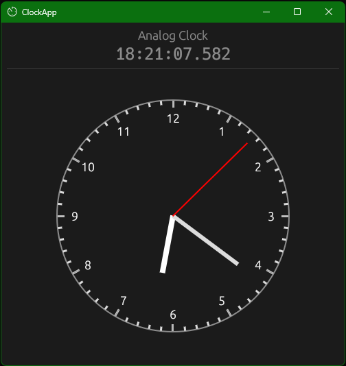

# rust_programming - Rust (Analog) Clock GUI 



Press `R` to see hands animation

## Install Rust

Use [rustup](https://rustup.rs/)

## Rust eframe

Documentation: [eframe 0.31.1](https://docs.rs/eframe/0.31.1/)

## Useful bunch of commands:

##### Regular bunch for development

```sh
clear ; cargo fmt --all --verbose ; cargo test ; cargo clippy -- ; cargo run ; 
```

##### Full project re-build

```sh
cargo clean ; git clean -fxd ; clear ; cargo fmt --all --verbose ; cargo test ; cargo clippy -- ; cargo build --release ; 
```

##### Very strict linting

```sh
clear ; cargo clippy -- --warn clippy::pedantic ;  
```

##### Create a dump to file (Linux-based environment only) - seach in stash list, close IDE before operation

```sh
sudo git clean -fxd ; tree -if --noreport | xargs -I {} sh -c '[ -f "{}" ] && echo "{}" && cat "{}" && echo' > dump.txt ; git add -A ; git stash save 'dump snapshot' ; 
```

#### Update Rust

```sh
rustup update stable ; 
```

### RUN

```sh
cargo run ; 
```

#### or

```sh
cargo run main.rs ; 
```

### Run test

```sh
cargo test ; 
```

### Create a release

```sh
cargo build --release ; 
```

### Formatting

To check formatting:

```sh
cargo fmt --all --check --verbose ; 
```

To apply formatting:

```sh
cargo fmt --all --verbose ; 
```

Fix with clippy:

```sh
cargo clippy --fix --lib ; 
```

### Linting

```sh
cargo clippy -- --warn clippy::pedantic ; 
```
